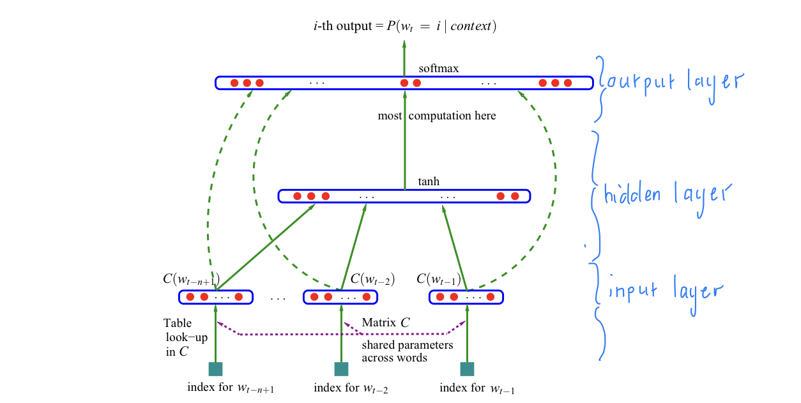

# Makemore
Makemore simply makes more of what it is given. It uses multiple character-level language models that predicts the next letter in a sequence of letters. 
 
interestingly one of the models is a transformer similar to the one used in GPT-3, which is kind of a big deal.

## Review of videos and project
* In progress...

# Buidling Makemore
## Part 1: The spelled-out intro to language modeling
### Part 1.1: Bigram approach
* Bigrams are a sequence of two letters. For example, the bigrams in the word "Makemore" are "Ma", "ak", "ke", "em", "mo", "or", "re". They are used to count the frequency of a letter following another letter. For example, the bigram "ak" appears 1 time in the word "Makemore", which is then used to calculate the probability of the next letter by the language model.
* We use the PyTorch library to build the bigram model. 
  * Pytorch is a deep learning library that is used to build neural networks. It is similar to Tensorflow, but it is more intuitive and easier to use.
  * We end up with the occurences of each bigram in the dataset, which is then used to calculate the probability of the next letter by the language model.
* We then sample from the distribution created (by torch.multinomial) to generate the next letter.
* Funny enough, we end up with terrible predictions. This is because the bigram model is not good at predicting the next letter in a sequence of letters. It is good at predicting the next word in a sequence of words, but not the next letter in a sequence of letters.
  * To convince ourselves that we are not crazy, and that the bigram model actually just works badly, we sample from a uniform distribution to get even more terrible results.
* Being good at tensor manipulation is crucual since some complicated operations are needed to build models.
  * One of these operations is broadcasting. Broadcasting is a way to perform operations on tensors of different shapes. For example, we can add a scalar to a vector, or a vector to a matrix, or a matrix to a tensor. This is done by broadcasting the smaller tensor to the shape of the larger tensor.
    * Andrej recommends to take a tutorial on broadcasting to understand it well, since it is easy to run into bugs when using it. (Very easy to create subtle bugs when using broadcasting)
* We created a model, but want to somehow evaluate the quality of a model.
  * We assign a probability to each bigram to scope it's quality. If the model is great each probability should be near 1, and if the model is bad each probability should be near 0.
  * Another measure is to use the Maximum Likelihood Estimate (MLE). MLE is the probability of the most likely sequence of letters. For example, if the most likely sequence of letters is "Makemore", then the MLE is 1. If the most likely sequence of letters is "Makemoree", then the MLE is 0.
    * Statisticians usually work with the log-likelihood, which is the log of the MLE. This is because the log-likelihood is easier to work with, and it is also easier to compare the log-likelihood of different models.
    * When the model is good log-likelihood is close to 0, and if it is bad log-likelihood is very negative. We want to work with loss functions, which has the convention of being low at 0 and high at infinity. So we negate the log-likelihood to get a loss function.
    * Goal: maximize likelihood, which is equavalent to minimizing the loss function (average of negative log-likelihood).
* Our model could give an infinity if a word is very unlikely. To prevent this we do model smoothing by adding 1 element-wise to the model.

### Part 1.2: Neural Network approach
* Since we now have a single-number loss function, we can use gradient descent to optimize the model.
* We create a bigram dataset for the model.
* To encode integers we use one-hot-encoding. For example, if we have 5 letters, then we encode each letter as a vector of length 5. The vector is all zeros except for a 1 in the index of the letter. For example, if the letter is "a", then the vector is [1, 0, 0, 0, 0]. If the letter is "e", then the vector is [0, 0, 0, 0, 1].
  * Pytorch has a function to do this called torch.nn.functional.one_hot.
* We then make the softmax function from scratch with differentiable operations (so that we can do backpropogation on it - explained thoroughly in [Mikrograd](https://github.com/karpathy/micrograd)).
  1. One-hot encode all the rows
  2. Predict log-counts
  3. Exponentiate them to approximate counts
  4. Normalize counts to get probabilities
  * Last 2 steps are Softmax.
  * These steps represent a forward pass.
  * We use los..backward() to do backpropogation, just like in micrograd.
* Andrej shows how to start with a random model and then optimize it using gradient descent.
  * We use the average negative log-likelihood as the loss function.
* To regularize loss we add W**2 to the loss function. This is called L2 regularization.

### Summary of Part 1
Andrej introduced the bigram character model, how to train the model, sample from the model, and evaluate the quality of the model using the average negative log-likelihood loss. We trained the model in two completely different ways that give the exact same result. In the first we just counted the frequency of all the bigrams and normalized, in the second we used the average negative log-likelihood loss to optimize the counts matrix using gradient descent. The latter model is much more flexible, but is still very simple. In the following videos it will complexify all the way to transformers.

## Part 2: MLP (Multi-Layer Perceptron) approach
* Last time we took a model that only had one character of context, so the predictions were not very good.
  * As the context increase the matrix of probabilities increase exponentially.
* The modelling approach we will adopt follows this [paper](https://proceedings.neurips.cc/paper/2000/file/728f206c2a01bf572b5940d7d9a8fa4c-Paper.pdf) on MLP by Bengio et al. (2003).
  * Instead of a word-level model, we will still keep the character-level approach.
  * If a certain sequence of characters has never been seen in the training set, making predictions with it will be doing so with _out-of-distribution_ data.
* The basic structure is an input layer, with a certain amount of neurons per word, then a hidden layer, and an output layer:   
  
  * The amount of nodes in the hidden layer is a hyperparameter.
    * A hyperparameter is a parameter that is not learned by the model, but is set by the user. 
  * The input layer:
    * We "cram" 27 unique characters into a 2 dimensional space for the table lookup.
    * We use 27 because we have 26 letters, plus a '.' to represent the end of a word.
    * We use 2 dimensions because we want to be able to visualize the table lookup.
  * The hidden layer:
    * Each tensor element is stored as a one-dimensional vector in memory.
    * Andrej might do a video about torch.tensor, since it is fascinating.
    * Using emb.view(-1, some_number) allows pytorch to infer the shape of the tensor.
  * The final layer:
    * We use F.cross_entropy to calculate the loss function.
    * F.cross_entropy is a function that combines the log_softmax and the negative log-likelihood loss.
      * Could be significantly more "numerically well-behaved" than the naive approach of using tanh.
      * With it backward pass and forward pass are both more efficient. 
* Just like in Micrograd, we use the average negative log-likelihood loss to optimize the model.
* Torch is a very large library, so there are many ways to do the same thing. For example, we can use torch.nn.functional.one_hot to one-hot-encode the input, or we can use torch.nn.Embedding to do the same thing.
* To optimize the model we train it on many mini-batches of examples, which makes the training much faster, but the gradient direction is slightly less accurate. Even though this happens it is still very useful.
  * To find the best learning rate we use torch.linspace to create a range of learning rates, and then we train the model on each learning rate and see which one gives the best loss.
    * With plot we can visualize the loss for each learning rate, then pick the one with the lowest loss.
    * At the late stages of training we want to decay the learning rate, which means we want to decrease the learning rate by 10x.
  * This is not how we would do it in production, but it is a good way to do it for testing purposes.
* We split the dataset into 3 splits: test, dev/validation, and train sets. Roughly 10% of the data is used for testing, 10% for validation, and the rest for training.
  * The test set is used to evaluate the model at the end.
  * The dev set is used to evaluate the model during training.
  * The train set is used to train the model.
* Since our dataset is so small we might be underfitting. To prevent this we can add more hidden layers, or increase the number of neurons in the hidden layer. (Andrej decides to experiment with the latter.)
  * By decreasing the learning rate Andrej managed to improve the model a lot.
  * The character dimension size is a bottle neck preventing much more improvement.
* We see the training and validation loss are seperating at the end of training, which means we are overfitting.
* By changing things we could beat Andrej's model performance of a 2.7 loss, but it would take a lot of time and effort. (Stay tuned for my result...)

### Summary of Part 2
Andrej introduced the MLP approach to building Makemore, which was discusses in the paper by Bengio et al. It consisted of 3 layers: input, hidden, and output. We looked at improving the model prediction by increasing the hidden layer size, and adjusting the learning rate as well as batch size - the batch size is used to increase the speed at which we train. To evaluate if our improvements worked we split the dataset into train, validation, and test sets, using the training set to train the model, the validation set to evaluate the model during training, and the test set to evaluate the model at the end. Using the paper and many adjustable options we could improve even further on Andrej's model. Andrej showed that the MLP approach works much better than the bag-of-words approach, but it could still be improved by a lot.

## Part 3: Activations, gradients, and BatchNorm
* In progress...

# References
* [Andrej Karpathy's Makemore project](https://github.com/karpathy/makemore)
* [Makemore Part 1](https://www.youtube.com/watch?v=PaCmpygFfXo&ab_channel=AndrejKarpathy)
* [Makemore Part 2](https://www.youtube.com/watch?v=TCH_1BHY58I&t=76s&ab_channel=AndrejKarpathy)
* [Makemore Part 3](https://www.youtube.com/watch?v=P6sfmUTpUmc&t=30s&ab_channel=AndrejKarpathy)
* [Makemore Part 4](https://www.youtube.com/watch?v=q8SA3rM6ckI&t=2185s&ab_channel=AndrejKarpathy)