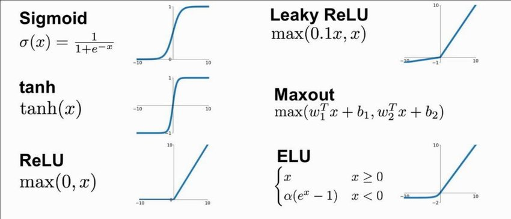
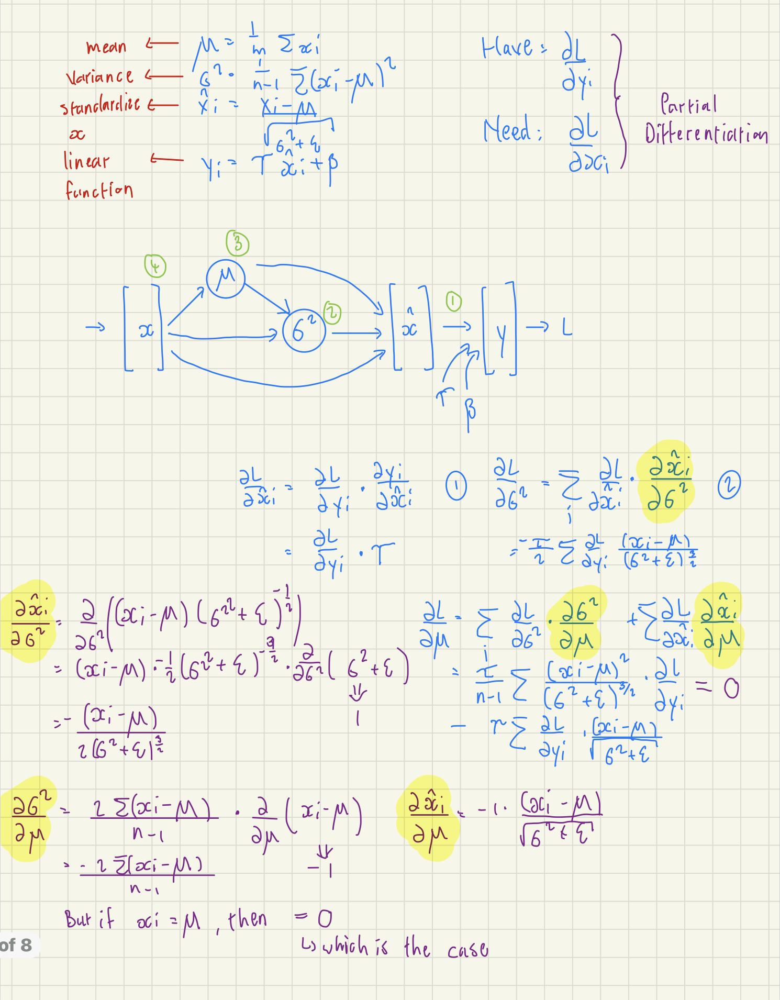
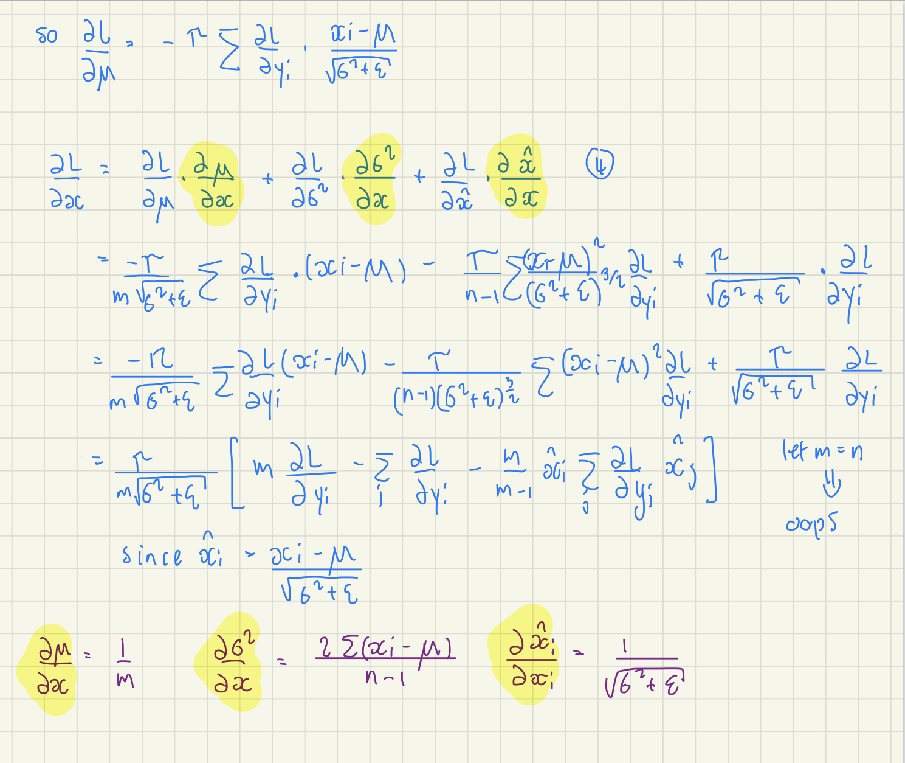

# Makemore
Makemore simply makes more of what it is given. It uses multiple character-level language models that predict the next letter in a sequence of letters. 
 
interestingly one of the models is a transformer similar to the one used in GPT-3, which is kind of a big deal.

## Review of videos and project
* In progress...

# Building Makemore
## Part 1: The spelled-out intro to language modeling
### Part 1.1: Bigram approach
* Bigrams are a sequence of two letters. For example, the bigrams in the word "Makemore" are "Ma", "ak", "ke", "em", "mo", "or", "re". They are used to count the frequency of a letter following another letter. For example, the bigram "ak" appears 1 time in the word "Makemore", which is then used to calculate the probability of the next letter by the language model.
* We use the PyTorch library to build the bigram model. 
  * Pytorch is a deep-learning library that is used to build neural networks. It is similar to Tensorflow, but it is more intuitive and easier to use.
  * We end up with the occurrences of each bigram in the dataset, which is then used to calculate the probability of the next letter by the language model.
* We then sample from the distribution created (by torch.multinomial) to generate the next letter.
* Funny enough, we end up with terrible predictions. This is because the bigram model is not good at predicting the next letter in a sequence of letters. It is good at predicting the next word in a sequence of words, but not the next letter in a sequence of letters.
  * To convince ourselves that we are not crazy and that the bigram model just works badly, we sample from a uniform distribution to get even more terrible results.
* Being good at tensor manipulation is crucial since some complicated operations are needed to build models.
  * One of these operations is broadcasting. Broadcasting is a way to perform operations on tensors of different shapes. For example, we can add a scalar to a vector, a vector to a matrix, or a matrix to a tensor. This is done by broadcasting the smaller tensor to the shape of the larger tensor.
    * Andrej recommends taking a tutorial on broadcasting to understand it well since it is easy to run into bugs when using it. (Very easy to create subtle bugs when using broadcasting)
* We created a model, but want to somehow evaluate the quality of the model.
  * We assign a probability to each bigram to scope its quality. If the model is great each probability should be near 1, and if the model is bad each probability should be near 0.
  * Another measure is to use the Maximum Likelihood Estimate (MLE). MLE is the probability of the most likely sequence of letters. For example, if the most likely sequence of letters is "Makemore", then the MLE is 1. If the most likely sequence of letters is "Makemoree", then the MLE is 0.
    * Statisticians usually work with the log-likelihood, which is the log of the MLE. This is because the log-likelihood is easier to work with, and it is also easier to compare the log-likelihood of different models.
    * When the model is good log-likelihood is close to 0, and if it is bad log-likelihood is very negative. We want to work with loss functions, which have the convenience of being low at 0 and high at infinity. So we negate the log-likelihood to get a loss function.
    * Goal: maximize the likelihood, which is equivalent to minimizing the loss function (average of negative log-likelihood).
* Our model could give an infinity if a word is very unlikely. To prevent this we do model smoothing by adding 1 element-wise to the model.

### Part 1.2: Neural Network approach
* Since we now have a single-number loss function, we can use gradient descent to optimize the model.
* We create a bigram dataset for the model.
* To encode integers we use one-hot-encoding. For example, if we have 5 letters, then we encode each letter as a vector of length 5. The vector is all zeros except for a 1 in the index of the letter. For example, if the letter is "a", then the vector is [1, 0, 0, 0, 0]. If the letter is "e", then the vector is [0, 0, 0, 0, 1].
  * Pytorch has a function to do this called torch.nn.functional.one_hot.
* We then make the softmax function from scratch with differentiable operations (so that we can do backpropagation on it - explained thoroughly in [Mikrograd](https://github.com/karpathy/micrograd)).
  1. One-hot encodes all the rows
  2. Predict log-counts
  3. Exponentiate them to approximate counts
  4. Normalize counts to get probabilities
  * The last 2 steps are Softmax.
  * These steps represent a forward pass.
  * We use loss.backward() to do backpropagation, just like in Micrograd.
* Andrej shows how to start with a random model and then optimize it using gradient descent.
  * We use the average negative log-likelihood as the loss function.
* To regularize loss we add W**2 to the loss function. This is called L2 regularization.

### Summary of Part 1
Andrej introduced the bigram character model, how to train the model, sample from the model, and evaluate the quality of the model using the average negative log-likelihood loss. We trained the model in two completely different ways that give the same result. In the first we just counted the frequency of all the bigrams and normalized, in the second we used the average negative log-likelihood loss to optimize the count's matrix using gradient descent. The latter model is much more flexible but is still very simple. In the following videos, it will complexify to transformers.

## Part 2: MLP (Multi-Layer Perceptron) approach
* Last time we took a model that only had one character of the context, so the predictions were not very good.
  * As the context increases the matrix of probabilities increases exponentially.
* The modeling approach we will adopt follows this [paper](https://proceedings.neurips.cc/paper/2000/file/728f206c2a01bf572b5940d7d9a8fa4c-Paper.pdf) on MLP by Bengio et al. (2003).
  * Instead of a word-level model, we will still keep the character-level approach.
  * If a certain sequence of characters has never been seen in the training set, making predictions with it will be doing so with _out-of-distribution_ data.
* The basic structure is an input layer, with a certain amount of neurons per word, then a hidden layer, and an output layer:   
  
  * The amount of nodes in the hidden layer is a hyperparameter.
    * A hyperparameter is a parameter that is not learned by the model but is set by the user. 
  * The input layer:
    * We "cram" 27 unique characters into a 2-dimensional space for the table lookup.
    * We use 27 because we have 26 letters, plus a '.' to represent the end of a word.
    * We use 2 dimensions because we want to be able to visualize the table lookup.
  * The hidden layer:
    * Each tensor element is stored as a one-dimensional vector in memory.
    * Andrej might do a video about torch.tensor, since it is fascinating.
    * Using emb.view(-1, some_number) allows PyTorch to infer the shape of the tensor.
  * The final layer:
    * We use F.cross_entropy to calculate the loss function.
    * F.cross_entropy is a function that combines the log_softmax and the negative log-likelihood loss.
      * Could be significantly more "numerically well-behaved" than the naive approach of using tanh.
      * With it backward pass and forward pass are both more efficient. 
* Just like in Micrograd, we use the average negative log-likelihood loss to optimize the model.
* Torch is a very large library, so there are many ways to do the same thing. For example, we can use torch.nn.functional.one_hot to one-hot-encode the input, or we can use torch.nn.Embedding to do the same thing.
* To optimize the model we train it on many mini-batches of examples, which makes the training much faster, but the gradient direction is slightly less accurate. Even though this happens it is still very useful.
  * To find the best learning rate we use torch.linspace to create a range of learning rates, and then we train the model on each learning rate and see which one gives the best loss.
    * With plot we can visualize the loss for each learning rate, then pick the one with the lowest loss.
    * At the late stages of training, we want to decay the learning rate, which means we want to decrease the learning rate by 10x.
  * This is not how we would do it in production, but it is a good way to do it for testing purposes.
* We split the dataset into 3 splits: test, dev/validation, and train sets. Roughly 10% of the data is used for testing, 10% for validation, and the rest for training.
  * The test set is used to evaluate the model at the end.
  * The dev set is used to evaluate the model during training.
  * The train set is used to train the model.
* Since our dataset is so small we might be underfitting. To prevent this we can add more hidden layers, or increase the number of neurons in the hidden layer. (Andrej decides to experiment with the latter.)
  * By decreasing the learning rate Andrej managed to improve the model a lot.
  * The character dimension size is a bottleneck preventing much more improvement.
* We see the training and validation loss are separating at the end of the training, which means we are overfitting.
* By changing things we could beat Andrej's model performance of a 2.7 loss, but it would take a lot of time and effort. (Stay tuned for my result...)

### Summary of Part 2
Andrej introduced the MLP approach to building Makemore, which was discussed in the paper by Bengio et al. It consisted of 3 layers: input, hidden, and output. We looked at improving the model prediction by increasing the hidden layer size, and adjusting the learning rate as well as batch size - the batch size is used to increase the speed at which we train. To evaluate if our improvements worked we split the dataset into the train, validation, and test sets, using the training set to train the model, the validation set to evaluate the model during training, and the test set to evaluate the model at the end. Using the paper and many adjustable options we could improve even further on Andrej's model. Andrej showed that the MLP approach works much better than the bag-of-words approach, but it could still be improved by a lot.

## Part 3: Activations, gradients, and BatchNorm
* Immediately, Andrej shows the intuition behind calibrating loss, since we get a ridiculously high initial loss.
  * Basically, the network is very confident in its predictions, but they are all wrong.
* Tanh just "squashes" the input values between -1 and 1.
  * Many of the values become -1 and 1, which is not good. As we saw in [Micrograd](https://www.youtube.com/watch?v=VMj-3S1tku0&ab_channel=AndrejKarpathy) this causes the gradient to be 0, which means the model cannot learn.
  * To fix the problem we just reduced W by a factor of 10. This puts the preactivation in a more reasonable range between -1.5 and 1.5, so the activations are between -0.9 and 0.9.
    * We could also predict W a bit less to have some extreme activations, but less of them is still better than what we had initially.
    * To set a good scale, we don't just hardcode it, but we use the standard deviation of the input to set the scale.
    * [Kaiming He et al.](https://arxiv.org/abs/1502.01852) showed that this is a good way to initialize the weights with the ReLU activation function and a convolutional neural network, but it also works well with the tanh activation function and an MLP.
      * In fact, PyTorch implements this method with [torch.nn.init.kaiming_normal_](https://pytorch.org/cppdocs/api/function_namespacetorch_1_1nn_1_1init_1ac8a913c051976a3f41f20df7d6126e57.html).
    * The standard deviation we use is calculated as gain / sqrt(fan_in), where the gain is the gain of the activation function, and fan_in is the number of input features.
      * The gain of the tanh activation function is 5/3.
      * The fan_in is the number of input features, which is the number of neurons in the previous layer.
* Some of the most common activations include the following:  
   
   
   

* Batch Normalization is a technique that normalizes the input to the activation function, which makes the training much more stable.
  * Sergey Ioffe and Christian Szegedy introduced it in [Batch Normalization: Accelerating Deep Network Training by Reducing Internal Covariate Shift](https://arxiv.org/abs/1502.03167), which was a very impactful paper since it helped train much deeper networks.
  * Basically, we just normalize hidden layers to make them roughly gaussian at initialization.
  * Stability given by Batch Normalization comes at a cost of accuracy, by introducing enough noise to the model that it cannot learn as well.
    * To combat this we could use other normalization techniques, such as Layer Normalization, Instance Normalization, or Group Normalization.
    * Batch Normalization was the first very efficient normalization technique, and it is still very popular, but many have tried to deprecate it given its accuracy issues.
* [Resnet](Other/resnet.py) is a very popular architecture that uses Batch Normalization.
  * Thus Batch Normalization can be done with torch.nn.BatchNorm1d.
* "I have shot myself in the foot with this layer over and over in my life. I don't want you to suffer the same... Avoid [BatchNorm] if possible." - Andrej Karpathy
  * Before Batch Normalization, it was very difficult to set the initial activations, which is why Batch Normalization was so impactful.
* Andrej shows how to do the entire lecture in PyTorch which reflects what we'll see in the real world most of the time.
* Tanh non-linearities basically help us build a neural network that can approximate any arbitrary function.
  * This is because tanh is a very flexible activation function.
  * However, it is not the most efficient activation function, and it is not the most stable activation function.
* Andrej shows useful plots in determining the learning rate, the update:data ratio, good weight updates, and good gradients. Batch Normalization makes it easy to get good results on each plot.

### Summary of Part 3
Andrej introduced:
1. Batch Normalization is one of the first modern innovations that helped stabilize training deep neural networks. To show this he built it entirely from scratch and showed how we would train with and without it - resulting in a much more stable model with Batch Normalization.
2. Pytorchifying the code, which is the process of converting the code from scratch to PyTorch. This showed that PyTorch is very easy to use, and it is very similar to the code we wrote from scratch, but entire layers can be implemented with a single line of code.
3. Plots and diagnostics we could use to understand if Neural Networks are in a good state dynamically. This is very useful for debugging and understanding what is going on in the model.

Andrej thinks our character length is a bottleneck to our current model, so we would have to look at more advanced architectures to improve our model in future videos.

## Part 4: Becomming a Backprop Ninja
* Instead of moving on to RNNs, Andrej wants to stay on backpropagation for a bit longer. He explained why in his medium blog post [Yes you should understand backprop](https://karpathy.medium.com/yes-you-should-understand-backprop-e2f06eab496b).
* To test understanding, Andrej added exercises to complete in this notebook.
  * I could barely do it by myself, and found it very unintuitive at first, but became very intuitive and clear after a few differentiations.
  * If you happened to have a Differential Equations course available to you, it would be very helpful to take it (I took it in university, and it made the derivation much easier to understand).
  * GitHub copilot is unreasonably helpful for these exercises.
  * Andrej uses mathematical concepts in abundance, making a fundamental understanding of statistics very important.
* To describe the logits of training neural nets, Andrej describes it as "pulling" down probabilities (dlogits) of being incorrect and "pulling" up the probabilities (dlogits) of being correct, so that this pulling system results in more correct answers as training progresses.
  * The dlogits are 0 where the probability of the prediction being correct is exactly 1, meaning the "pulling" force is essentially null.
* The mathematics involved was quite intense and interesting. I managed to do most calculations without Andrej's help and pointed out in red what statistical concepts were used and in purple what calculus concepts were used for those who are curious about what they should master when it comes to math and stats. 
   
  
  
   

### Summary of Part 4
PyTorch is a powerful Machine Learning Library that significantly speeds up the process of training neural networks, but the torch.backward() has taken away much of what makes backward propagation so powerful, so Andrej went back to 2012 to show how backpropagation by hand was done in order to replace the backward() function. In the process, we were expected to be proficient at calculus and know basic statistics, which we used to derive backpropagation from scratch. This was a very interesting and challenging exercise, but it was very rewarding to see how the math works behind the scenes, as well as how simple it is in hindsight. This is by far one of the best backpropagation explanations I've had and contributed to the depth of my and many others' understanding.

## Part 5: Building a WaveNet
* [WaveNet](https://arxiv.org/abs/1609.03499) is an autoregressive model used to predict audio.
  * Autoregressive models_ are models that predict the next value based on the previous values.
* Andrej basically follows from part 3.

* __In progress...__

# References
* [Andrej Karpathy's Makemore project](https://github.com/karpathy/makemore)
* [Makemore Part 1](https://www.youtube.com/watch?v=PaCmpygFfXo&ab_channel=AndrejKarpathy)
* [Makemore Part 2](https://www.youtube.com/watch?v=TCH_1BHY58I&t=76s&ab_channel=AndrejKarpathy)
* [Makemore Part 3](https://www.youtube.com/watch?v=P6sfmUTpUmc&t=30s&ab_channel=AndrejKarpathy)
* [Makemore Part 4](https://www.youtube.com/watch?v=q8SA3rM6ckI&t=2185s&ab_channel=AndrejKarpathy)